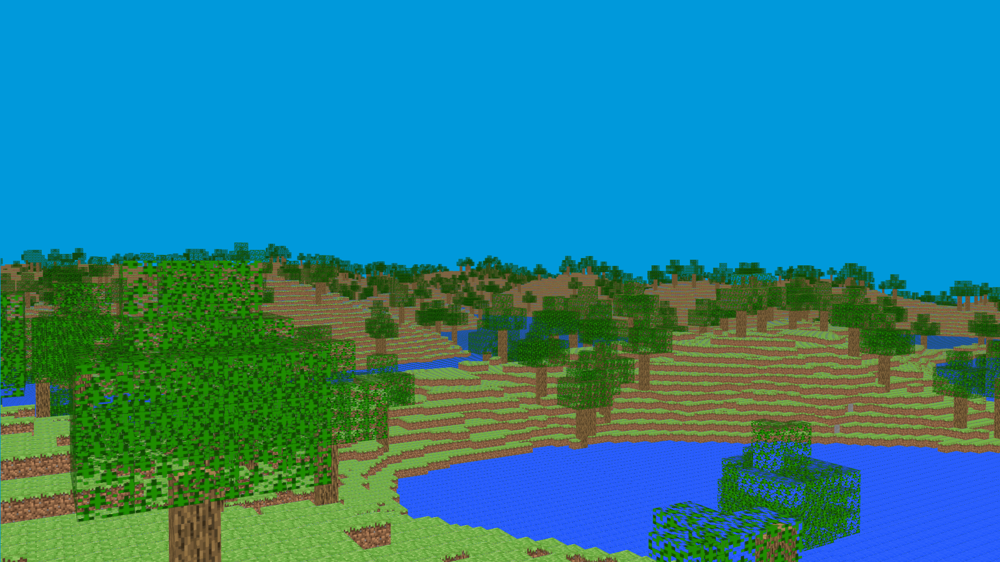
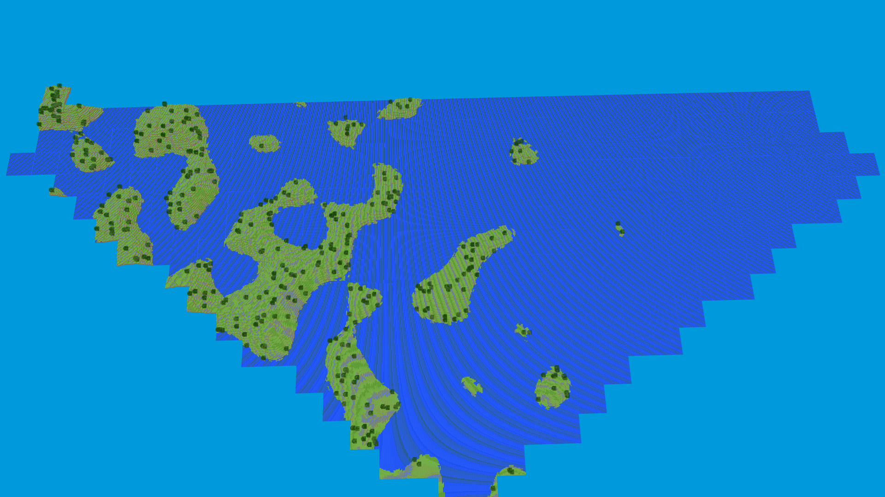
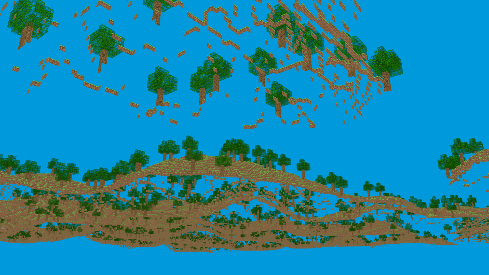
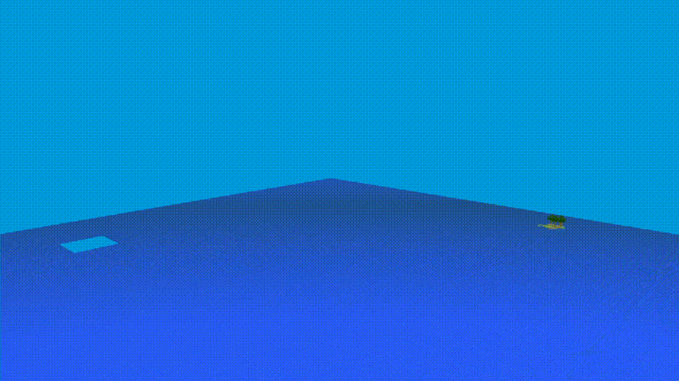

# Minecraft Clone
Hi! I am Sahil. This is a small Minecraft clone I made to learn about managing large projects, some data structures and rendering using OpenGL.

This program was written under Linux, But the code is portable and you should be able to built it under windows. 

All the dependencies are contained in the repo and is included using CMake. So no other programs have to be installed.
## Features
This program supports the following features:

- This program supports **procedural terrain generation** with land, water and some trees scattered here and there.
- This program supports **textures** and **transparent textures** for the tree leaves.
- **Camera movement** support to navigate around the terrain with easy controls.
- **Dynamic chunk rendering**, parts of the world are loaded and unloaded depending on the player position.
- **Saved Chunks**: The generated chunks are saved in the ```data/``` directory. So they can be loaded faster the second time it is loaded.
- Face culling, frustum culling and other commonly used **graphics optimization techniques** are used to enable **real-time rendering** even on low end graphics cards.
- Cross-platform: all the tools used are **cross-platform** and all the function used are from the standard C++ library.
## Build and Run
Tools Required:
- cmake
- Ninja or make
- Any C++ compiler
```
git clone https://github.com/sahil-1035/minecraft-clone.git
cd minecraft-clone
mkdir build
cmake -B build -G Ninja
ninja -C build
./build/Minecraft
```
For make, replace the above ```cmake``` and ```ninja``` commands with the following:
```
cmake -B build
make -C build
```
## Why I made this project

The main reason I worked on this project is to learn. Some valuable skills I learned:

- **Git**: This was the first ever project I worked on with git.
- **CMake**: This was also my first project that uses cmake.
- **Large Projects**: I usually work on small projects, so this was a new learning experience.
- **Optimization**: As this involved real-time rendering, I had to consider the performance implications of the algorithms I implemented.
- **OpenGL**: I also learned how real-time graphics rendering pipeline using OpenGL worked.

## External Libraries
This program uses the following external libraries:

- [**glew**](https://glew.sourceforge.net/): OpenGL Extension Wrangler library for managing OpenGL extensions across different platforms.
- [**glfw**](https://www.glfw.org/): For cross-platform window and input management. 
- [**stb_image.h**](https://github.com/nothings/stb/blob/master/stb_image.h): For image loading functionality for textures.
- [**FastNoiseLite.h**](https://github.com/Auburn/FastNoiseLite/blob/master/Cpp/FastNoiseLite.h):   Noise generation library for procedural terrain.
- [**glm**](https://github.com/g-truc/glm): OpenGL mathematics library for simple vector and matrix operations.

## Demo
- Some images of the program:

- Chunks behind the player do not get drawn:

- Block faces that are between two opaque blocks and block faces that are facing away from the camera do not get rendered:

- Dynamic chunk loading:

